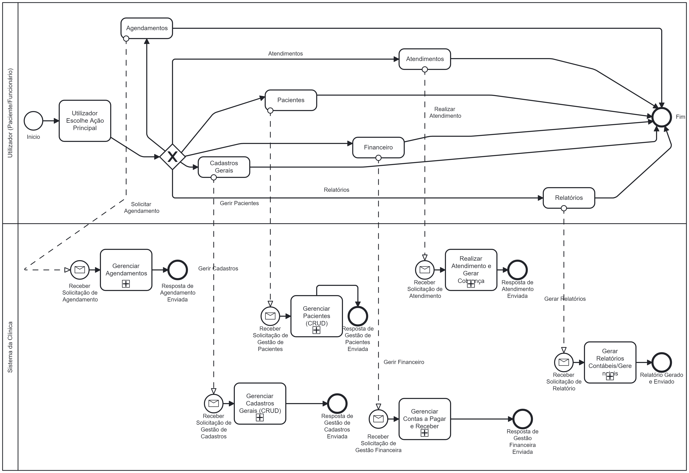

# C-Medic

**C-Medic** é um sistema de gestão para clínicas médicas e consultórios, desenvolvido em **Node.js**, com o objetivo de organizar agendamentos, exames, pacientes, materiais e estoques de forma eficiente e automatizada.

---

## 📚 Sumário

- [Funcionalidades Implementadas](#-funcionalidades-implementadas)
- [Requisitos Funcionais](#-requisitos-funcionais)
- [Requisitos Não Funcionais](#-requisitos-não-funcionais)
- [Diagrama BPMN do Processo de Agendamento](#-diagrama-bpmn-do-processo-de-agendamento)
- [Tecnologias Utilizadas](#️-tecnologias-utilizadas)
- [Estrutura do Projeto](#-estrutura-do-projeto)

---

## 📌 Funcionalidades Implementadas

### 👨‍⚕️ Gestão de Pacientes
- CRUD completo de pacientes com rastreamento do funcionário que criou o registro.

### 🔬 Gestão de Exames
- Cadastro de exames com código, tipo e valor. Registro de autor.

### 👥 Gestão de Funcionários
- CRUD com dados pessoais, cargo, contato e admissão.

### 🧾 Gestão de Fornecedores
- Inclusão de fornecedores físicos e jurídicos com inativação e rastreamento.

### 🧪 Gestão de Materiais e Estoque
- Controle de insumos, validade, ponto de pedido e fornecedor associado.

### 📊 Relatórios de Estoque
- Listagens de materiais com baixo estoque ou próximos ao vencimento.

### 📆 Agenda e Horários
- Geração de agendas por datas/dias da semana, horários com intervalos e encaixes.

### 📋 Agendamento
- Múltiplos agendamentos estilo carrinho, com verificação de duplicidade.
- Controle de status: Aberto, Marcado, Cancelado, Realizado.
- Detalhamento por paciente.

### 💉 Atendimento e Faturamento
- Registro de atendimentos a partir de agendamentos.
- Cálculo de valores (exames + materiais).
- Geração e gestão de contas a receber.

### 💰 Gestão Financeira (Contas a Receber/Pagar)
- Cadastro, pagamento, cancelamento e relatórios detalhados.
- Categorias de despesa com rastreamento de autor.

### 📈 Relatórios Contábeis e Gerenciais
- Fluxo de caixa, aging list, DRE simplificado, faturamento e despesas por categoria.

---

## 📋 Requisitos Funcionais

**RF01:** O sistema deve permitir o cadastro, consulta, atualização e exclusão de Pacientes.
**RF02:** O sistema deve permitir o cadastro, consulta, atualização e exclusão de Exames.
**RF03:** O sistema deve permitir o cadastro, consulta, atualização e exclusão de Materiais, incluindo controle de estoque, ponto de pedido e data de validade.
**RF04:** O sistema deve permitir a geração de Agendas (com dias e horários de atendimento).
**RF05:** O sistema deve permitir a criação de horários de encaixe na agenda.
**RF06:** O sistema deve permitir o agendamento de um ou mais horários (para um ou múltiplos exames) para um Paciente em uma única transação (estilo carrinho).
**RF07:** O sistema deve impedir que um Paciente seja agendado para um horário que já está ocupado por outro agendamento ativo.
**RF08:** O sistema deve impedir que um Paciente seja agendado para o mesmo horário mais de uma vez, a menos que o agendamento anterior esteja cancelado.
**RF09:** O sistema deve permitir a alteração do status de um agendamento (e do horário associado) para "Marcado", "Cancelado" ou "Realizado".
**RF10:** O sistema deve permitir a visualização dos agendamentos de um Paciente.
**RF11:** O sistema deve permitir o cadastro, consulta, atualização e exclusão de Funcionários, incluindo seu cargo.
**RF12:** O sistema deve permitir o cadastro, consulta, atualização e exclusão (ou inativação) de Fornecedores.
**RF13:** O sistema deve permitir o cadastro, consulta, atualização e exclusão de Categorias de Despesa.
**RF14:** O sistema deve permitir o cadastro, consulta, atualização (incluindo pagamento) e cancelamento de Contas a Pagar.
**RF15:** O sistema deve gerar automaticamente uma Conta a Receber ao criar um Atendimento.
**RF16:** O sistema deve permitir a consulta, registro de pagamento, cancelamento e alteração de vencimento de Contas a Receber.
**RF17:** O sistema deve permitir a criação de um Atendimento a partir de um agendamento, associando materiais e gerando valores.
**RF18:** O sistema deve registrar qual funcionário realizou o cadastro de entidades como Exames, Materiais, Pacientes, Atendimentos, Fornecedores, Categorias de Despesa e Contas a Pagar.
**RF19:** O sistema deve fornecer relatórios de: Baixo Estoque de Materiais e Materiais Próximos ao Vencimento.
**RF20:** O sistema deve fornecer relatórios contábeis de: Fluxo de Caixa, Contas a Receber (Aging), Contas a Pagar (Aging), DRE Simplificado, Faturamento por Exame, Despesas por Categoria.

---

## ⚙️ Requisitos Não Funcionais

**RNF01:** O sistema deve ser desenvolvido utilizando Node.js e Express.js.
**RNF02:** O sistema deve utilizar Sequelize como ORM.
**RNF03:** O sistema deve utilizar MySQL como banco de dados.
**RNF04:** A API deve ser RESTful e retornar dados no formato JSON.
**RNF05:** O tempo de resposta para requisições comuns da API deve ser inferior a 2 segundos sob condições normais de carga.
**RNF06:** Informações sensíveis (como senhas de banco de dados) devem ser gerenciadas através de variáveis de ambiente em produção.
**RNF07:** O código-fonte deve ser modular e bem organizado para facilitar a manutenção e escalabilidade.

---

## 🌊 Diagrama BPMN do Processo de Agendamento



---

## 🛠️ Tecnologias Utilizadas

-   **Node.js** com **Express** para o backend e construção da API.
-   **Sequelize** como ORM (Object-Relational Mapper) para a interação com o banco de dados.
-   **MySQL** como sistema de gerenciamento de banco de dados relacional.
-   **XAMPP** (ou Docker, ou instalação direta do MySQL) para o ambiente de banco de dados local.
-   **CORS** para gerenciamento de Cross-Origin Resource Sharing.
-   **date-fns** para manipulação de datas.
-   (Para testes) Arquivos .http com a extensão REST Client do VSCode (ou similar).

---

## 📁 Estrutura do Projeto

```bash
C-Medic/
├── src/
│   ├── config/           # Configurações de banco de dados (database.js)
│   ├── controllers/      # Responsáveis por receber as requisições HTTP, chamar os serviços e enviar respostas
│   │   ├── Agendamento/
│   │   ├── Atendimento/
│   │   ├── CategoriaDespesa/
│   │   ├── ContaPagar/
│   │   ├── ContaReceber/
│   │   ├── Exames/
│   │   ├── Fornecedor/
│   │   ├── Funcionario/
│   │   ├── Materiais/
│   │   ├── Pacientes/
│   │   └── Relatorios/
│   ├── models/           # Definição das tabelas e seus relacionamentos (Sequelize - indexModel.js, etc.)
│   ├── routes/           # Definição dos endpoints (URLs) da API (agendamentoRoutes.js, etc.)
│   └── services/         # Camada contendo a lógica de negócio da aplicação
│       ├── Agendamento/
│       ├── Atendimento/
│       ├── CategoriaDespesa/
│       ├── ContaPagar/
│       ├── ContaReceber/
│       ├── Exames/
│       ├── Fornecedor/
│       ├── Funcionario/
│       ├── Materiais/
│       ├── Pacientes/
│       └── Relatorios/
├── bpmn/                 # Arquivos BPMN (XML e/ou imagens)
│   └── bpmn.png
│   └── visaoGeralSistemaClinica.bpmn # Exemplo do BPMN de visão geral
│   └── criarExame.bpmn             # Exemplo do BPMN de criar exame
│   └── agendamentoCarrinho.bpmn    # Exemplo do BPMN de agendamento carrinho
├── tests/                # Arquivos de teste .http (ou testes automatizados futuros)
│   ├── agendamentos.http
│   ├── atendimentos.http
│   ├── categoriasDespesa.http
│   ├── contasAPagar.http
│   ├── contasAReceber.http
│   ├── exames.http
│   ├── fornecedores.http
│   ├── funcionarios.http
│   ├── materiais.http
│   ├── pacientes.http
│   └── relatorios.http
├── .gitignore
├── app.js                # Arquivo principal de configuração e inicialização do Express
├── package-lock.json
├── package.json
└── README.md             # Esta documentação
```

---